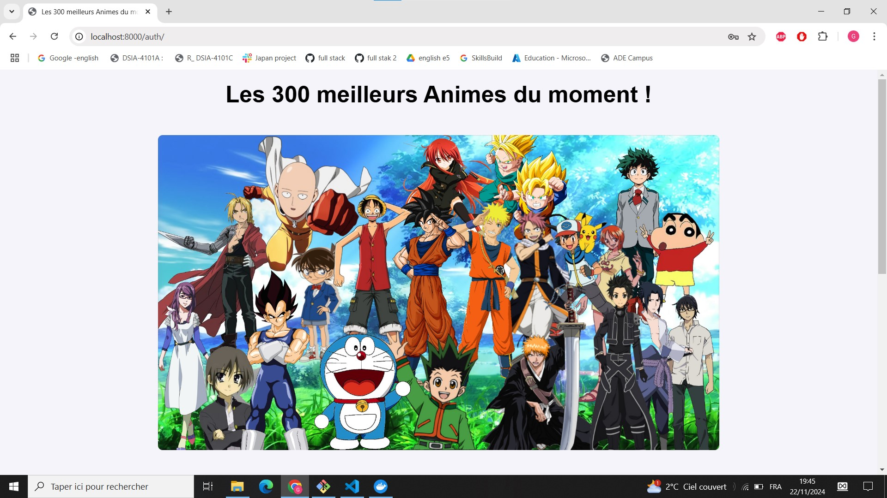

# Les 300 meilleurs animes du moment 

## Table des matières 
- [Les 300 meilleurs animes du moment](#les-300-meilleurs-animes-du-moment)
  - [Table des matières](#table-des-matières)
  - [Description générale](#description-générale)
  - [Critères d'évaluation](#critères-dévaluation)
  - [Description du sujet choisi](#description-du-sujet-choisi)
  - [User guide](#user-guide)
    - [Déploiement](#déploiement)
    - [Inscription et connexion](#inscription-et-connexion)
    - [Utilisation de l'application](#utilisation-de-lapplication)
      - [Dashboard Streamlit autour de l’analyse des données](#dashboard-streamlit-autour-de-lanalyse-des-données)
        - [Intégration avec FastAPI et adaptation](#intégration-avec-fastapi-et-adaptation)
        - [Adaptation des données pour Streamlit](#adaptation-des-données-pour-streamlit)
        - [Pourquoi Streamlit et FastAPI ?](#pourquoi-streamlit-et-fastapi-)
        - [Fonctionnalités du tableau de bord](#fonctionnalités-du-tableau-de-bord)
        - [**1. Onglet : Classement des Animes**](#1-onglet--classement-des-animes)
          - [1. Barre de recherche](#1-barre-de-recherche)
          - [2. Filtrage par tranche de rang](#2-filtrage-par-tranche-de-rang)
          - [3. Histogramme des studios les plus productifs](#3-histogramme-des-studios-les-plus-productifs)
          - [4. Distribution des animes selon leur statut](#4-distribution-des-animes-selon-leur-statut)
          - [5. Diagramme circulaire des genres les plus populaires](#5-diagramme-circulaire-des-genres-les-plus-populaires)
          - [6. Histogramme du nombre d’épisodes par anime](#6-histogramme-du-nombre-dépisodes-par-anime)
          - [7. Diagramme de dispersion pour les producteurs les plus actifs](#7-diagramme-de-dispersion-pour-les-producteurs-les-plus-actifs)
        - [**2. Onglet : Recherche par genre et/ou thème**](#2-onglet--recherche-par-genre-etou-thème)
  - [Developer guide](#developer-guide)
    - [Vue d'ensemble](#vue-densemble)
    - [Architecture du code](#architecture-du-code)
      - [Modèles](#modèles)
      - [Schémas](#schémas)
      - [Routes](#routes)
      - [Services](#services)
      - [Templates](#templates)
    - [La base de données](#la-base-de-données)
  - [Les difficultées rencontrées](#les-difficultées-rencontrées)

## Description générale  
Ce projet vise à déployer une application full stack avec FastAPI et PostgreSQL. L'application est conteneurisées via des multi-conteneurs Docker afin de pouvoir lancer aisément l'application sur toute machine. Il existe de nombreux frameworks d'API permettant de développer des applications web performantes et évolutives. Cette unité impose l'utilisation de FastAPI. Ce dernier  est un tout nouveau framework web Python, open source et très performant. Il présente de nombreux avantages comme des méthodes de validation robustes et une documentation automatique et interactive ou encore. De plus, FastAPI propose des mécanismes de sécurité intégrés, comme OAuth2, JWT (JSON Web Tokens), et des permissions de rôle, ce qui le rend bien adapté pour les applications nécessitant une gestion sécurisée des utilisateurs et des ressources. Dans notre application, une authentification sécurisée des utilisateurs est requise, ainsi FastAPI est tout à fait adapté à nos besoins. 

## Critères d'évaluation

Le projet doit se lancer intégralement avec Docker Compose
Le projet doit contenir au moins deux services : 
- Une API écrite en python avec FastAPI
- Une base de données Postgresql
- La base de données contiendra une table User

Un système d'authentification devra être mis en place 
- Soit un simple système comme vu en cours : Récupération d’un JWT à l’aide d’un username / password
- Soit avec le système d’authentification Keycloak
- Au moins un endpoint d’API sécurisé à l’aide d’une authentification JWT

Gestion des erreurs HTTP avec try / except
Utiliser du typing partout 

## Description du sujet choisi

Dans le cadre de notre application, nous avons décidé de nous pencher sur les animes. Plus précisément, nous avons sélectionné les 300 meilleurs animes d'apres [MyAnimeList](https://myanimelist.net/topanime.php). Ce site met à jour quotidiennement le classement des meilleurs animes.    

Ainsi, nous n'avions pas initialement de jeu de données. Nous avons donc créé un jeu de données à partir des informations disponibles sur les 300 premiers animes. Pour ce faire, nous avons scrapé les données du site en utilisant le module Scrapy et en nous basant sur le code source de la page principale et de la page personnalisée de chaque anime. Enfin, nous avons stocké cela dans un fichier csv "anime.csv" qu'on a utilisé par la suite pour insérer nos données dans la base de données Postgres.  

Il y a de nombreuses caractéristiques données sur les animes lorsqu'on inspecte le site. Nous avons sélectionné celles qui nous semblaient le plus intéressantes, dans notre fichier, elles sont nommées de la façon suivante : 
- **rank** : le classement (utilisé comme identifiant dans la base de données)
- **titre** : le titre
- **score** : score obtenu, utilisé pour déterminer le classement
- **episodes** : le nombre d'épisodes, pour les données manquantes (marquées "unknown"), nous avons mis le numéro du dernier épisode sorti
- **statut** : précise si l'anime est en cours ou est terminé
- **studio** : le studio 
- **producteurs** : les producteurs
- **genres_themes** : les genres et thèmes associés à l'anime (sous forme de liste)
- **lien** : le lien pour accéder à la page personnalisée de chaque anime

Notre objectif était donc de concevoir une application permettant à l'utilisateur d'intéragir avec la base de données sur les anime afin qu'il en sache davantage sur les meilleurs animes du moment.  

## User guide

### Déploiement

Premièrement, il vous faut cloner notre projet git, pour cela : 
- Lancez un terminal Bash et aller dans le répértoire qui vous convient pour télécharger le projet
- Copiez cette commande dans le terminal : git clone https://github.com/aumailll/AMAR_AUMAILLE_Full_Stack_Application.git

Pour pouvoir tester et utilisation l'application, il faut disposer de Docker. Si vous ne possédez pas Docker, rendez-vous sur la page de téléchargement officielle de Docker (pour Windows) [ici](https://www.docker.com/products/docker-desktop/). Suivez les instructions d'installation affichées à l'écran ensuite.

Une fois Docker bien installé, vous pouvez réaliser les étapes de lancement de l'application : 
- Dans l'application Docker Desktop, appuyez sur "Start Engine" pour démarrer Docker
- Allez dans le répértoire contenant le projet cloné 
- Copiez la commande suivante : docker compose up --build
- Faites ctrl + c pour arrêter les conteneurs (et donc l'application)

Nous vous conseillons également (pour votre espace de stockage) de faire : 
- docker compose down
- docker volume rm nom_volume (pour voir les volumes, faites : docker volume ls)

Il faudra sûrement attendre quelques minutes le temps que les conteneurs démarrent et que le téléchargement des données d'anime dans la base de données s'effectue. Voici ce que vous devriez voir dans le terminal une fois que l'application est prête à être utilisée :   
  

Enfin, copiez la ligne suivante dans votre navigateur favori : http://localhost:8000 . Ce lien vous mène à notre application. 

### Inscription et connexion

Si tout s'est bien passé lors du déploiement de l'application, vous arrivez sur une page d'inscription

  
  

 

Pour accéder au reste de l'application et plus particulièrement pour découvrir des informations sur les animes, la connexion est obligatoire. La première fois il faut renseigner un email et un mot de passe dans le formulaire d'inscription. Si vous êtes déjà inscrit, un lien sur lequel il faut cliquer vous permettra d'accéder au formulaire de connexon. Une fois que cette inscription a été réalisée, vous serez redirigé vers la page contenant le formulaire de connexion. 

### Utilisation de l'application

#### Dashboard Streamlit autour de l’analyse des données

Dans ce projet, nous avons développé un tableau de bord interactif basé sur une étude existante. Cette étude initiale, réalisée et stockée sur ce [dépôt GitHub](https://github.com/aumailll/AMAR_AUMAILLE_Projet_Data_Engineering), a servi de base pour extraire, nettoyer et analyser les données des 300 meilleurs animes. 

Le projet initial avait pour but d'explorer les données à l’aide de Python et d’outils analytiques standards. Nous avons étendu cette étude en ajoutant une couche de visualisation et d’interactivité via **Streamlit**, que nous avons choisi pour son esthétique, sa simplicité d’utilisation, et sa capacité à produire des graphiques et interfaces utilisateurs performantes.

##### Intégration avec FastAPI et adaptation

Pour enrichir l’étude initiale et construire une application web robuste et modulaire, nous avons utilisé **FastAPI** pour structurer l’API qui alimente le tableau de bord. Voici les principales étapes et choix que nous avons réalisés pour adapter le projet :

1. **Création d’une base de données relationnelle (PostgreSQL)** :
   - Les données issues du projet initial ont été nettoyées et insérées dans une base PostgreSQL.
   - Nous avons structuré les données autour des tables `anime` (informations sur les animes) et `user` (gestion des utilisateurs).

2. **Routes et endpoints FastAPI** :
   - Nous avons défini des endpoints spécifiques pour interagir avec les données via des appels API. Par exemple :
     - `GET /animes` : pour récupérer les informations des animes selon des critères définis.
     - `POST /users` : pour enregistrer les utilisateurs.
     - `GET /genres` : pour obtenir la liste des genres disponibles.
   - Ces routes respectent la logique **CRUD** (Create, Read, Update, Delete) et sont conçues pour répondre aux besoins des fonctionnalités du tableau de bord.

3. **Services FastAPI** :
   - La logique métier et les interactions complexes avec la base de données ont été encapsulées dans des **services**. Ces derniers permettent :
     - La gestion des utilisateurs (authentification via JWT).
     - La sélection et le filtrage des données selon des paramètres dynamiques.
     - La génération de réponses adaptées au tableau de bord Streamlit.

4. **Modularité et séparation des responsabilités** :
   - **FastAPI** s’occupe de la gestion et de la sécurité des données via des routes bien définies.
   - **Streamlit** se concentre sur la présentation des données et l’interactivité, en consommant les données fournies par FastAPI.

##### Adaptation des données pour Streamlit

L’un des défis principaux a été d’adapter les données issues de l’étude initiale pour qu’elles soient utilisables par le tableau de bord Streamlit. Voici comment nous avons procédé :

- **Nettoyage des données** :
  - Les données initiales contenaient des informations manquantes ou mal formatées. Par exemple :
    - Les épisodes marqués comme "unknown" ont été remplacés par le dernier épisode connu.
    - Les genres et producteurs, fournis sous forme de listes non uniformes, ont été normalisés.
  - Ces données nettoyées ont été stockées dans une base PostgreSQL pour permettre des requêtes performantes.

- **Connexion Streamlit ↔ PostgreSQL via FastAPI** :
  - Streamlit consomme les données via des appels API vers FastAPI, garantissant :
    - Une structure claire et maintenable.
    - Une abstraction des détails de la base de données.
    - Une sécurité accrue grâce aux mécanismes d’authentification intégrés.

- **Génération dynamique de graphiques** :
  - Les données récupérées depuis FastAPI sont transformées et visualisées dans Streamlit. Par exemple :
    - Les genres et thèmes sont regroupés et affichés dans un diagramme circulaire.
    - Les studios sont triés par productivité et visualisés sous forme d’histogramme.

##### Pourquoi Streamlit et FastAPI ?

Nous avons choisi **Streamlit** pour sa capacité à offrir une expérience utilisateur fluide et interactive, et **FastAPI** pour sa robustesse dans la gestion des données et des requêtes API. Ce duo nous permet de :

- **Conserver la structure modulaire de FastAPI** :
  - Les données sont accessibles à travers des routes bien définies.
  - La logique métier est isolée dans des services, ce qui facilite la maintenance et l’extension.

- **Offrir une visualisation intuitive via Streamlit** :
  - Streamlit exploite les données de manière graphique, permettant à l’utilisateur final d’interagir facilement avec le contenu.

En combinant ces deux outils, nous avons transformé une étude de données statique en une application web dynamique et évolutive, accessible via [http://localhost:8501](http://localhost:8501).

##### Fonctionnalités du tableau de bord

Le tableau de bord interactif est conçu pour offrir une exploration intuitive et approfondie des 300 meilleurs animes. Voici une présentation des fonctionnalités principales, chacune accompagnée d'une explication détaillée et d'une capture d'écran illustrative.

Le tableau de bord est divisé en deux onglets principaux pour une navigation intuitive :

1. **Classement des Animes** : Présentation des animes triés par rang, avec des fonctionnalités interactives pour explorer les données.
2. **Recherche par Genre ou Thème** : Permet de filtrer et de trouver des animes correspondant à des genres ou thèmes spécifiques.

Cette séparation est gérée via `st.tabs()` dans le fichier `main_dash.py`, facilitant l'organisation et la modularité du code.

##### **1. Onglet : Classement des Animes**
###### 1. Barre de recherche

La barre de recherche permet aux utilisateurs de trouver rapidement un anime en entrant tout ou partie de son titre. Une fois la recherche effectuée, les détails de l’anime correspondant sont affichés, notamment son score, le studio, le statut (en cours ou terminé), les genres associés, et le nombre d’épisodes. Cette fonctionnalité est particulièrement utile pour les utilisateurs qui souhaitent accéder directement aux informations d’un anime spécifique sans parcourir l’ensemble du classement.

###### 2. Filtrage par tranche de rang

Le tableau de bord inclut un slider interactif qui permet de filtrer les animes en fonction de leur position dans le classement. Les utilisateurs peuvent définir une plage de rangs (par exemple, les 10 premiers ou les 30 derniers) pour explorer les données correspondant à leurs centres d’intérêt. Cette fonctionnalité facilite la navigation dans des sections spécifiques du classement, en se concentrant uniquement sur les animes qui importent à l’utilisateur.

###### 3. Histogramme des studios les plus productifs

Cet histogramme visualise le nombre d’animes produits par chaque studio, en mettant en avant les studios les plus prolifiques. Chaque barre représente un studio, et sa hauteur indique le volume de productions. Cela permet d’identifier rapidement les grands acteurs de l’industrie, offrant une vue d’ensemble des studios qui contribuent significativement au classement des meilleurs animes.

###### 4. Distribution des animes selon leur statut

Un histogramme affiche la répartition des animes par statut (terminé, en cours, ou autres). Ce graphique donne un aperçu clair de la proportion d’animes achevés ou toujours en production parmi les meilleurs. Cela aide les utilisateurs à comprendre les tendances actuelles de l’industrie et à choisir des séries terminées pour une expérience de visionnage complète.

###### 5. Diagramme circulaire des genres les plus populaires

Le diagramme circulaire montre la répartition des genres et thèmes les plus fréquents parmi les 300 meilleurs animes. Ce graphique est idéal pour visualiser les préférences générales du public et les tendances de l’industrie, en identifiant les genres dominants comme l’action, l’aventure, ou le drame. Les utilisateurs peuvent ainsi repérer facilement les genres qu’ils souhaitent explorer davantage.

###### 6. Histogramme du nombre d’épisodes par anime

Cet histogramme présente les animes triés par leur nombre d’épisodes sous forme de barres horizontales. Cela permet aux utilisateurs de voir si les animes longs (50+ épisodes) ou courts (12-24 épisodes) dominent le classement. Cette fonctionnalité est utile pour les spectateurs qui préfèrent des séries adaptées à leur disponibilité en termes de durée.

###### 7. Diagramme de dispersion pour les producteurs les plus actifs

Ce graphique met en relation le nombre de productions d’un producteur et les scores des animes associés. Chaque point représente un producteur et ses productions, avec une taille de point proportionnelle au score des animes. Cela permet d’identifier les producteurs les plus influents et de comprendre leur rôle dans la création de contenus populaires.

##### **2. Onglet : Recherche par genre et/ou thème**

L'onglet "Recherche par Genre ou Thème" permet aux utilisateurs d'explorer les animes en fonction de leurs préférences personnelles. Une liste déroulante interactive offre la possibilité de sélectionner un ou plusieurs genres ou thèmes parmi ceux disponibles, avec des suggestions par défaut comme "Action" et "Award Winning", tout en laissant l'utilisateur libre de choisir d'autres catégories. Les animes correspondant aux critères sélectionnés sont présentés sous forme de fiches détaillées. Chaque fiche contient des informations clés telles que le titre de l'anime, une image de couverture récupérée dynamiquement depuis la page MyAnimeList (si disponible), ainsi que des données complémentaires comme le score, le studio de production, les genres et thèmes associés, le statut (terminé ou en cours) et le nombre d'épisodes. Un lien cliquable dirige également l'utilisateur vers la page détaillée de l'anime pour en savoir davantage. Si aucun anime ne correspond aux genres ou thèmes sélectionnés, un message d’avertissement clair informe l’utilisateur, garantissant une expérience fluide et intuitive.

## Developer guide

### Vue d'ensemble

L'application est une plateforme qui interagit avec une base de données PostgreSQL pour gérer des informations sur les animes. Elle est développée avec FastAPI et suit une architecture modulaire organisée autour des concepts de modèles, schemas, services, routers, et de templates HTML pour l'interface utilisateur. Tout cela est contenu dans le dossier "api"

A la racine du projet, il y a ce readme ainsi que le fichier de configuration de Docker Compose, le DockerFile et le dossier "Data" contenant les données sur les animes. Comme nous avons procédé à un scraping des données, il y a également un dossier "anime_fullstack" qui est un projet scrapy, dans les spiders, il y a notamment la spider anime.py. 

### Architecture du code

La majeure partie du travail se situe dans le dossier "api". C'est lui qui contient tous les scripts et la logique liés à FastAPI. 

#### Modèles 
Représentés par le dossier "models" ils contiennent toute la configuration concernant la création des tables, la création de la base de données et l'insertion des données dans les tables. Pour établir un lien avec la base de données, on définit un URL de connexion ainsi que les paramètres d'authentification. On créé aussi un engine et une session, c'est ce qui nous permet d'intéragire avec notre BDD. 

#### Schémas 
Les schémas permettent de conserver l'intégrité des données utilisées par l'application. Ils utilisent Pydantic pour valider les données reçues ou envoyées via l'API et s'assurent que les données échangées entre le front et le end respectent le format attendu. Nous avons défini des schémas pour les données des users, des animes et du token généré. 

#### Routes
Les routes permettent de découper les points d'accès de l'API en modules logiques. Elles se trouvent dans le dossier "routers" de notre projet. Elles définissent l'interface de communication et l'interface d'interaction avec l'application. Elles suivent la logique CRUD: create, read, update, delete.

#### Services
Ils contiennent la logique métier et les interactions complexes avec la base de données.Ils permettent d'effectuer des traitements de données (par exemple sélectionner les 10 premiers éléments). 

#### Templates
Il s'agit de la partie frontend. Ce sont des pages html pour accueillir les utilisateurs. Ils permettent de rendre dynamiquement des pages web avec Jinja2. 

#### Static
Ce dossier contient tous nos fichiers CSS qui nous ont permis d'améliorer l'esthétique de nos pages html.  

    

### La base de données 

PostgreSQL, souvent connu sous le nom de postgres est un système de gestion de bases de données relationnelles open-source. Il est conçu pour gérer de grandes quantités de données tout en offrant des performances élevées. Comme il s'agit d'un système de base de données relationnelles, il repose sur la notion de "tables" et des règles strictes concernant les attributs de ces tables. Dans le cadre de notre application, nous utilisons postgres pour définir et remplir les tables Anime et User qui contiennent respectivement les informations sur les meilleurs animes et les informations de connexion des utilisateurs. Par ailleurs, postgres permet également le stockage des données non relationnelles type JSON. C'est donc un outil très intéressant.  
Comme nous l'avions mentionné plus haut, nous utilisons l'image officielle proposée par Docker avec la dernière version (spécifiée dans le docker compose) de postgres pour l'utiliser. 

## Les difficultées rencontrées 
Au cours du développement de notre application, nous avons rencontré quelques difficultés. Nous avons découvert le framework FastAPI et le système de base de données Postgres. De plus, l'année dernière, nous n'avions pas fait un dashboard avec Flask, nous n'avions donc pas cette premiere expérience avec les APIs.  
La première difficultée abordée a été l'insertion des données : à l'origine, nous voulions directement intégrer dans la table dédiée aux animes les animes scrapés. L'objectif était donc de lancer le scraping et automatiquement insérer les données dans la table "anime". Nous avons perdu beaucoup de temps dessus en raison de petits détails (données manquantes, problèmes de caractères spéciaux, données numériques considérées comme textuelles...) Ainsi, nous avons choisi de stocker les données en local, de nettoyer le csv obtenu pour avoir le format attendu pour la table dans la base de données et enfin de stocker les valeurs. 
Nous nous sommes aussi "fait avoir" avec les volumes persistants, ce qui a entraîné une grande perte de temps à essayer de résoudre des corrections déjà apportées alors qu'il nous suffisait de supprimer les volumes persistants (docker volume rm nom_volume). 

